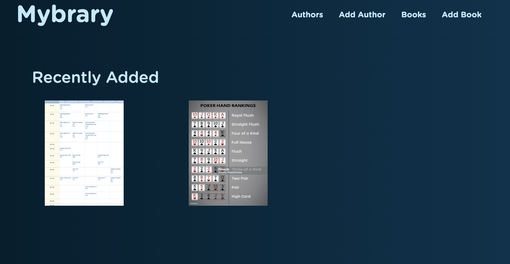
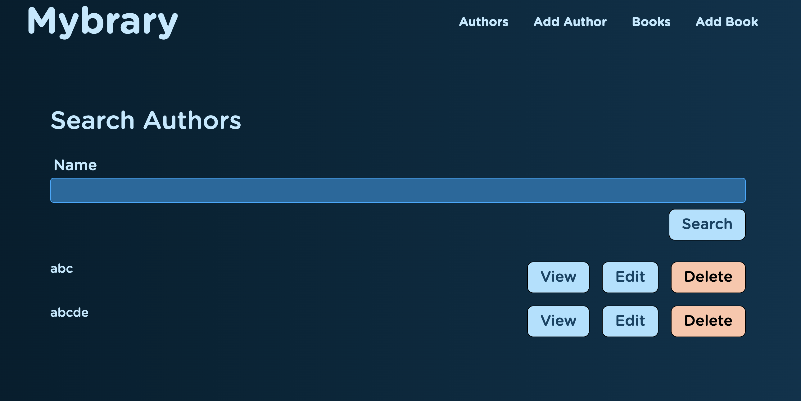
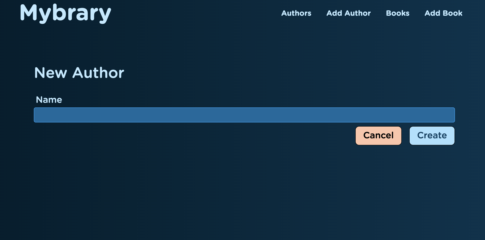
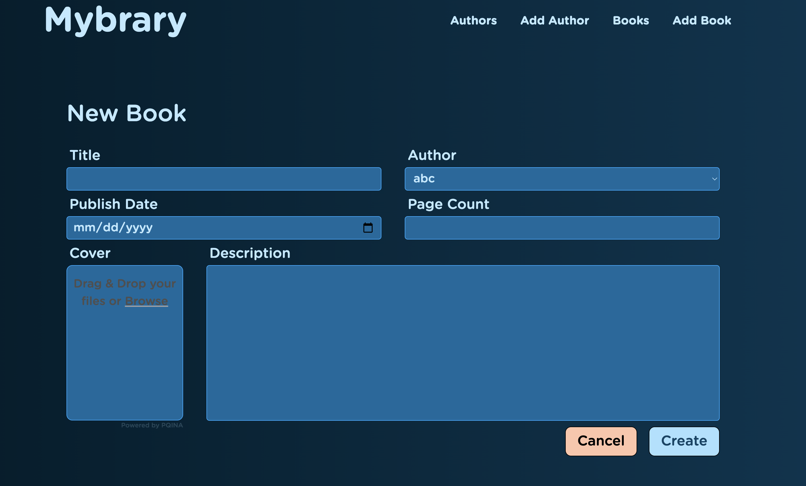
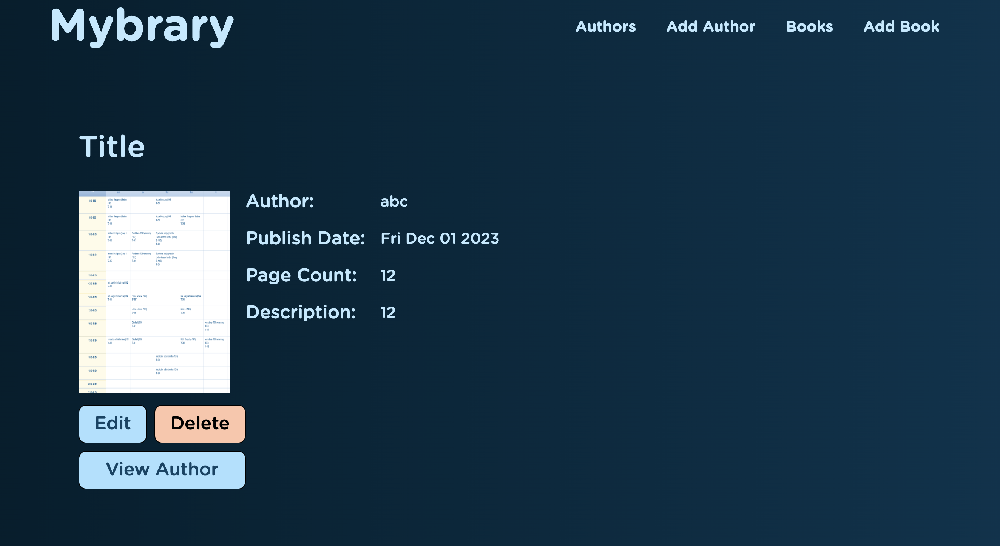

# Mybrary📚 - A Library Management Web Application

## Overview
Mybrary is a robust web application designed for library management. It features a comprehensive system for managing books and authors, with an intuitive user interface and advanced functionalities.

## Features

### File Upload Improvements
- **FilePond Integration:** Enhanced file handling and user experience.
- **Upload Preview:** Visual previews of file uploads.
- **Drag & Drop Upload:** Simplified file uploading.
- **Database Storage:** Adapted for Heroku's ecosystem, storing files in the database.

### Author Management
- **CRUD Operations:** Complete routes for Show, Edit, Update, and Delete operations for authors.
- **Views for Authors:** Dedicated views for author management.
- **Validation and Deletion:** Data validation checks and a delete form.
- **Enhanced Navigation:** Streamlined author management in the application interface.

### Book Management
- **CRUD Operations:** Full routes for managing books including Show, Edit, Update, and Delete.
- **Views for Books:** Tailored views for book management.
- **Database Interactions:** Robust interaction with the database for book updates and deletions.
- **Finalized Navigation:** Polished navigation for book management.

## Technologies Used
- **Backend**: Express, Node.js
- **Database**: MongoDB, Atlas (cloud database management)
- **Frontend**: HTML, CSS, JavaScript, Ejs
- **Others**: Git(version control),
Heroku(deployment)

## Screenshots📸
Here are some screenshots to demostarte the web:
- **index:** index page shows recently the added book with the cover

- **search author:**

- **add author:**

- **add book:**

- **view book:**

## Installation
1. Clone the repository.
2. Install dependencies: `npm install`
3. Start the server: `npm start`

## Contributing 🤝
If you would like to contribute to the Mybrary Website, you are welcome to submit pull requests. Please follow these guidelines:

Fork the repository and create a new branch for your contribution.

Make your changes and test them thoroughly.

Submit a pull request describing the changes you have made, along with any relevant information or context.

Ensure your code follows best practices and is well-documented.

## Issues and Bug Reports 📝
If you encounter any issues or bugs while using the Mybrary Website, please submit an issue on the GitHub repository. Provide detailed information about the problem, including steps to reproduce it, if possible.

## Contact 📞📧
If you have any questions, suggestions, or feedback, feel free to contact the project maintainer:
[Weike ZHANG](mailto:weike0702@gmail.com)
